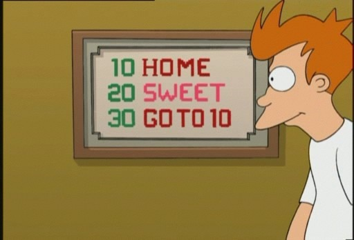

# My tutorial

This is a nice tutorial about coding. This is a nice tutorial about coding. This is a nice tutorial about coding. This is a nice tutorial about coding. This is a nice tutorial about coding.

You'll learn:

* JavaScript
* Draw with code
* Make games

## Feedback:

> **Users** are welcomed to send *feedback*.
> It is a great pleasure to read your emails.



## Code

Check out this neat program I wrote using the `var x = 0` snippet:

```
var x = 0;
x = x + 2;
circle(100, 100, x);

function draw()
{
  for(var i = 0; i < 100; i++)
  {
    circle(i * 10, i, 100;)
  }
}
```

| Tables        | Are           | Cool  |
| ------------- |:-------------:| -----:|
| **col 3 is**  | right-aligned | $1600 |
| col 2 is      | *centered*    |   $12 |
| zebra stripes | ~~are neat~~  |    $1 |


Happy coding! ... and check [Tutorial 2](tutorial://2)
